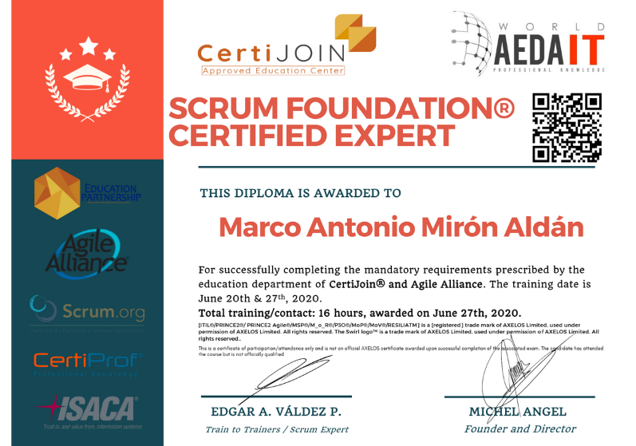
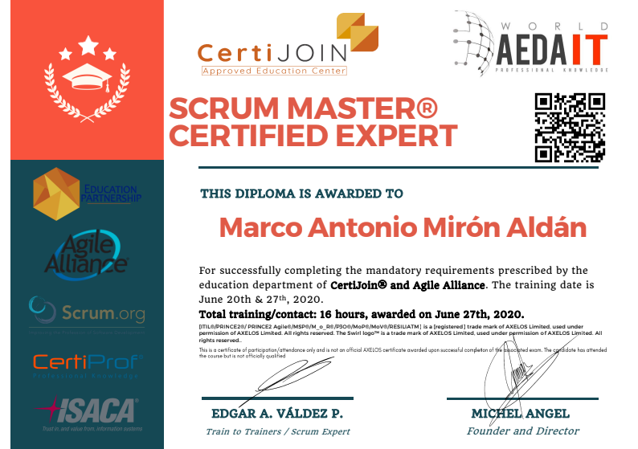

Marco Antonio Mirón Aldán
## QA Tester | Ingeniero en Sistemas Computacionales

### CONTACTO
- 📧 Email: mrc.aldan@gmail.com
- 📱 Teléfono: 297 203 0414

---

### 👨‍💻 **SOBRE MÍ**
Soy un QA Tester con más de 5 años de experiencia en el diseño y ejecución de pruebas para aplicaciones Web y Android, trabajando en entornos ágiles (SCRUM). Mi enfoque está en asegurar la calidad y reducir defectos en producción, aplicando metodologías de pruebas manuales y automatizadas.

---

### 🔧 **STACK TÉCNICO**
- **Lenguajes de programación:** SQL, Python, Java, Javascript.
- **Herramientas:** Jira, Scrum, Postman, Selenium, JMeter.

---

### 📂 **EXPERIENCIA PROFESIONAL**
#### QA Tester | Ensitech | Remoto | Febrero 2024 - Diciembre 2024
- Diseño y ejecución de pruebas en aplicaciones Web y Android.
- Pruebas de API con Postman para detección temprana de errores.
- Automatización de pruebas repetitivas con Selenium.
- Gestión de bugs y seguimiento en Jira.
- Metodologías ágiles (Scrum).

#### Ingeniero de Pruebas | Northware | Remoto | Julio 2022 - Septiembre 2023
- Creación de suites de prueba, test plans y ejecución en Jira.
- Pruebas de API y rendimiento con Postman y JMeter.
- Coordinación con equipos de desarrollo para integración de cambios.

---

### 📜 **CERTIFICACIONES**
- **SCRUM FOUNDATION® Certified expert** (Junio 2020)

- **SCRUM MASTER® Certified expert** (Junio 2020)

### CURSOS
- **ISTQB Certified Tester Foundation Level (CTFL 4.0)** (2024)
- **Selenium Webdriver con Python** (2024)
- **Software Testing avanzado** (2024)

---

### 🌐 **HABILIDADES BLANDAS**
Autogestión, versatilidad, proactividad, cooperación, comunicación.

---

### 📁 **IDIOMAS**
- Español: Nativo
- Inglés: Intermedio (B1) (Amplio dominio al leer, escribir y escuhar, sigo mejorando mis habilidades al hablarlo.)
